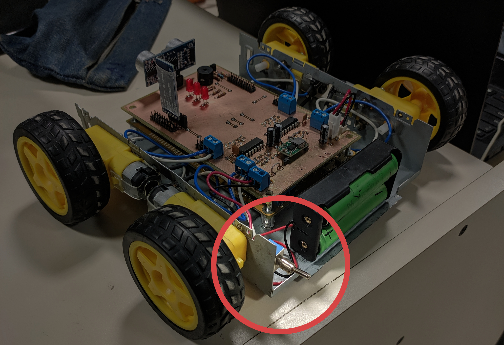

# Manual de Usuario

1. Para poder utilizar el vehículo, se debe tener la aplicación BLE Joystick
(https://play.google.com/store/apps/details?id=iyok.com.blejoystick) instalada
en un teléfono Android.

2. El vehículo contiene una llave para cortar la alimentación de baterías:

3. Conectar el teléfono alvehículo, una vez establecida la conexión, el LED del
   módulo HM-10 quedará fijo y dejará de titilar.

